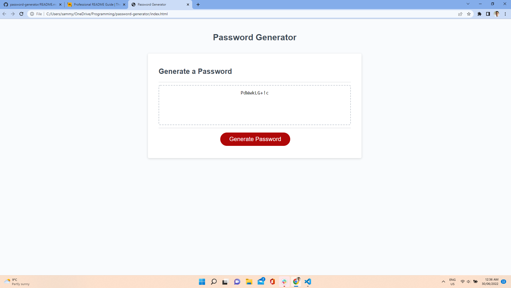

# <Password-Generator>

## Description
I want the code to take in several parameters involving the types of characters used in the password, and then to output a randomaly generated script based on those parameters. I built this to imporove my knowlegde of loops and arrays and using them to generate unique items. This code will generate a password without any need of typing on the users part, other than a simple number in the begining.

## Usage

## Credits

A mention must go to my fellow classmates for helping me organise my choas. Thank You